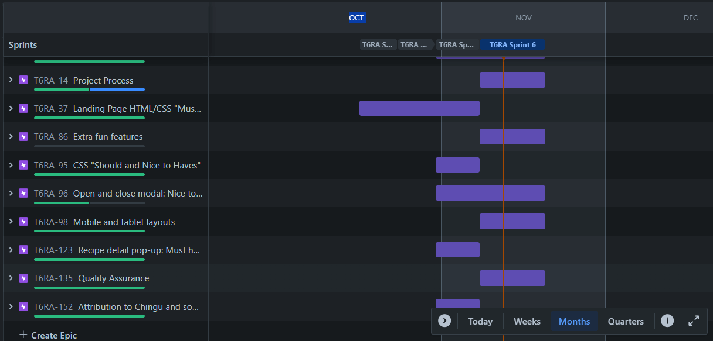
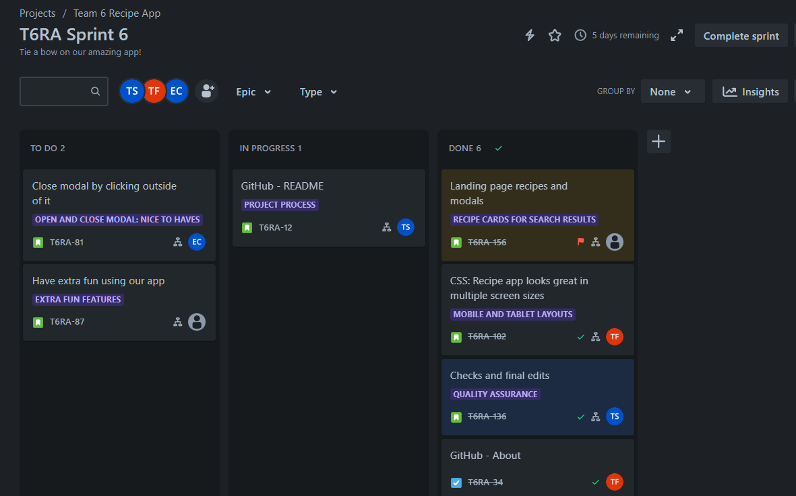
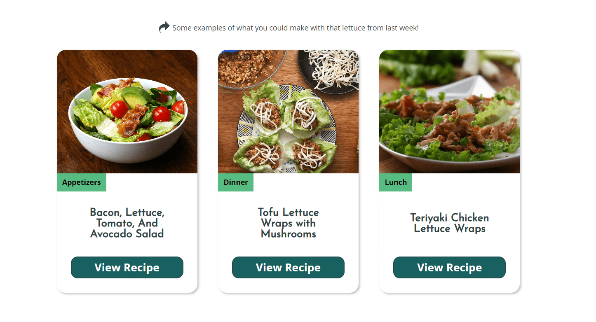
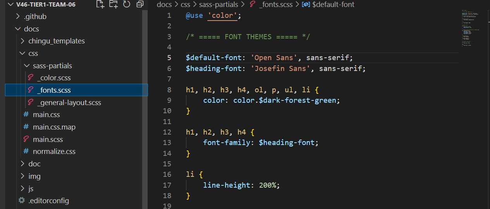

# Zero-Waste Recipes

## Overview:
Reduce food waste by searching our database for an ingredient that you have getting ready to spoil in your refrigerator or pantry.  You'll get a list of delicious recipes made with that exact ingredient.

## Features:

### [Design comp built on Figma](https://www.figma.com/file/JLp3V0M7hHHeFnvGYglq5Y/recipe-app?type=design&node-id=0%3A1&mode=design&t=bgoSiYiUgFwDWgln-1)
- Responsive design features 1 recipe example on mobile 3 recipe examples on desktop to make finding the suggestions for use on the landing page easy to see
  - 
  
- Refresh button to navigate back to the homepage easily
### Built using Agile principles and SCRUM methodology 
- Team of 4 Developers: [Begum](https://www.linkedin.com/in/begumvernondeveloper/), [Erica](https://www.linkedin.com/in/charwaeericachong/), [Tauri](https://www.linkedin.com/in/tauri-stclaire/), and [Terri](https://www.linkedin.com/in/terri-fricker/).
- 6 week long sprints
- Tauri operated as designer and product owner in charge of managing the Sprint backlog.

- Our team frequently employed pair programming to teach each other Sass and work on Javascript together
### Focus on Accessibility:
- 100% Accessibility Rating through [Lighthouse](https://developer.chrome.com/docs/lighthouse/overview/)!
- All colors for design checked with [WebAIM Contrast Checker](https://webaim.org/resources/contrastchecker/) and passed WCAG AAA ratings
- Fonts no smaller than 16px, larger readable recipe cards

- All button inputs and icons are labeled for screen readers
- SVGs are used instead of fonticons to improve access for people who have adjusted their fonts in the browser
- all links and buttons labeled, aria-label for links and within the buttons with a class designating for screen readers only
- The "View Recipes" buttons and exit-buttons have an additional `aria-describedby`
attribute so that people who use screen readers are forewarned that a modal will be opening up and then closing with each respective button
- All links have `aria-describedby` letting people who use screen readers know that it will open up a new tab and go to a different website
- Cards are clickable anywhere for people with mobility issues, but buttons are kept as anchor points for someone using a keyboard only
### Dry Code focused on Readability:
- Sass: variables, partials, and nesting

- Semantic layout:
    - BEM for classes
- SVGs are coded into the HTML to decrease processing power, which is more green!
- Vanilla Javascript that prioritizes readability
    - Async fetch functions
    - Form validation
    - Functions declared so they are hoisted
    - 

## Running the Project:
- Deployed to [GH-Pages](https://chingu-voyages.github.io/v46-tier1-team-06/)
- [Github Repo](https://github.com/chingu-voyages/v46-tier1-team-06)

## Dependencies:

**TastyAPI**  Our app fetches recipes from the TastyAPI found at [Rapid API: Tasty API](https://rapidapi.com/apidojo/api/tasty).  The call is made to the `recipes/list` endpoint.

**IcoMoon for SVGs** [Main website](https://icomoon.io/), and Terms of Use(https://icomoon.io/#termsofuse)

**Dart Sass** [CSS pre-processor](https://sass-lang.com/)

